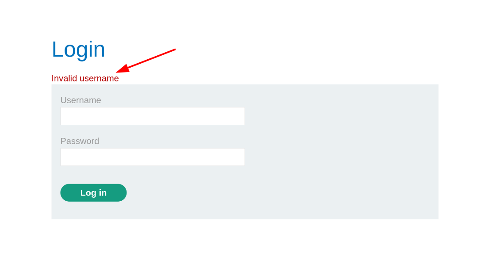
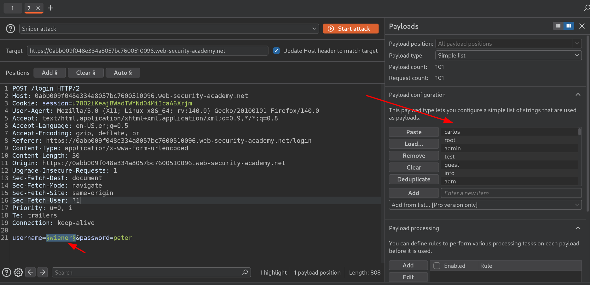
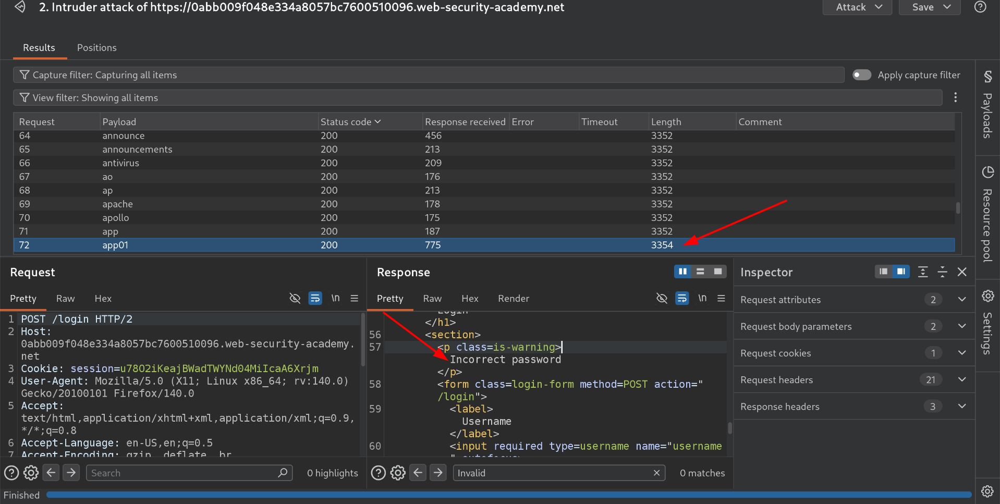
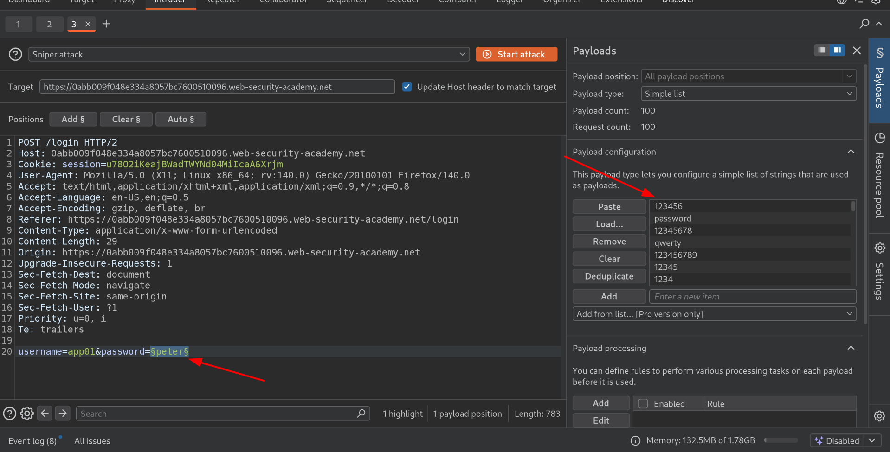
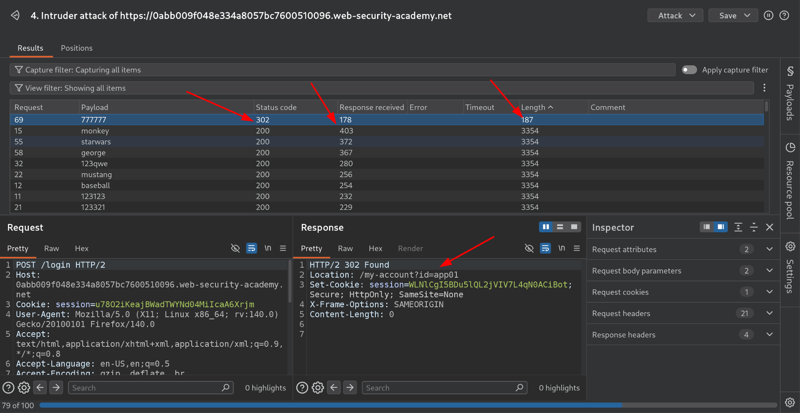
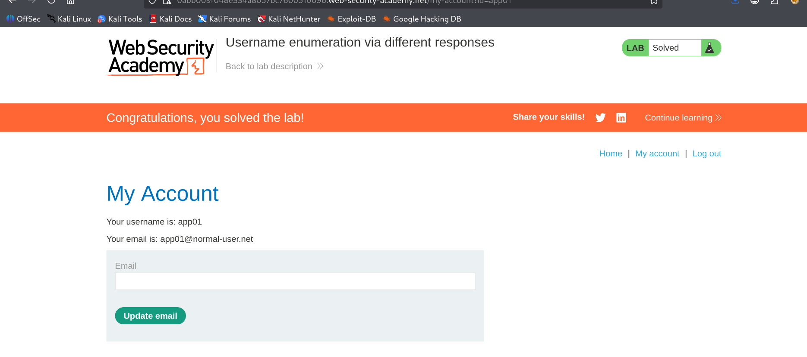

## Username enumeration via different responses

### WE ARE PROVIDED WITH CANDIDATE USERNAME AND PASSWORD
- [Username](./username.txt)
- [Password](./passwords.txt)

## LET'S START THE LAB:
- Trying to login with default username and password i.e `wiener` and `peter` — it shows **Invalid username** as a verbose error.



- So, first let's bruteforce for the `username`, let's see it's response
- Ok, I send the request into the `intruder` and now ready to bruteforce the username with common usernames we are provided for this lab.

- And, now while bruteforcing everyOther request is giving me a `response Length` of 3352 but one one request gave me response length of 3354, so I think like why this difference and see that request
    - Often seeing that request I get the verbose error as:
    ```
    Incorrect password
    ```
- This proves that we got the correct username i.e `app01`

- NOw we got the correct username, from here we will go into bruteforcing the password.

## PASSWORD BRUTEFORCING
- We have correct username as:
```
username=app01
password=<WE WILL BRUTEFORCE IT>
```
- Sending the request to intruder with correct username and giving payload as default password we are provided in this lab.

- Now while bruteforcing I got the 302 status code on one request everyother was 200 and this was 302 so checking this request it was redirecting me to the login page, here we found the correct password i.e `777777`
- That request redirecting me to: `/my-account?id=app01` means we have been loggedin as user: `app01`
```
username=app01
password=777777
```


- Hence loggin with that username and password we solved the lab.
 

SOLVED


