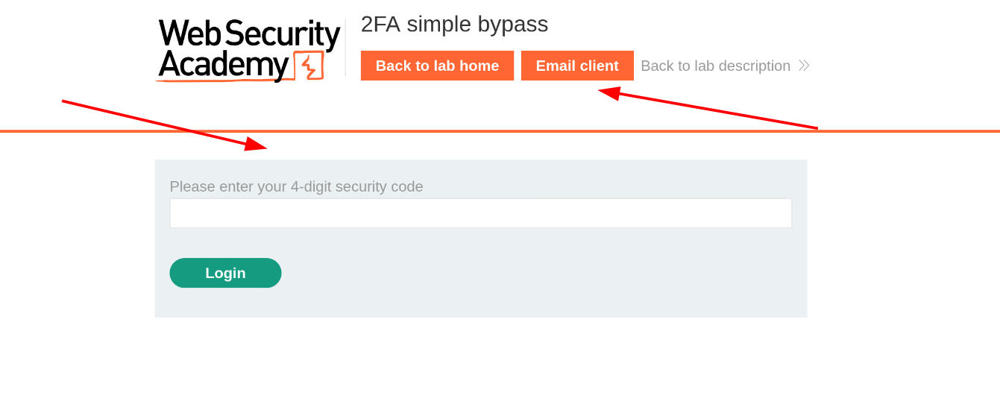
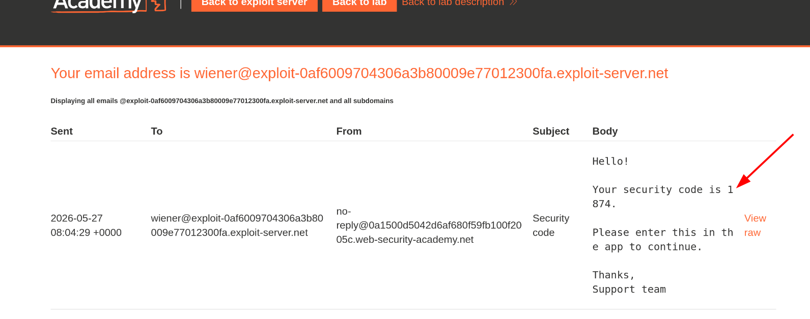
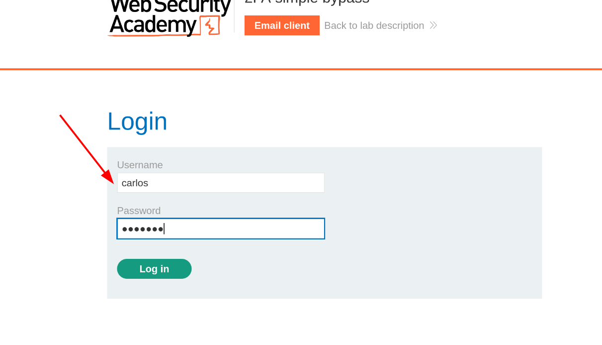
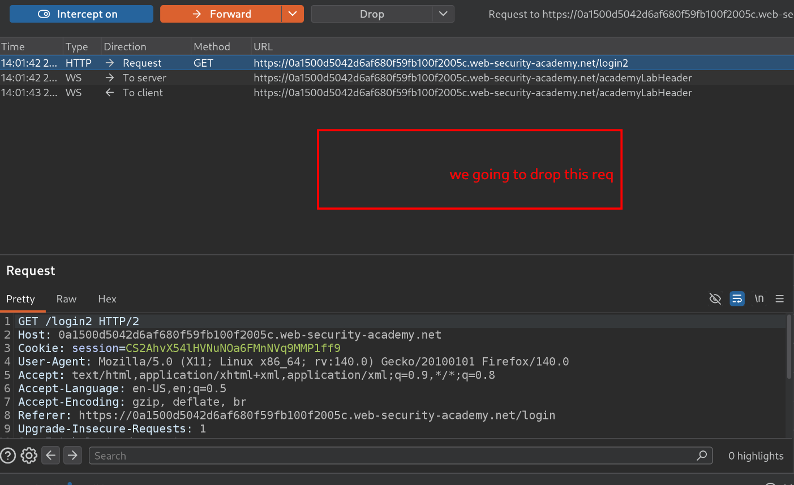
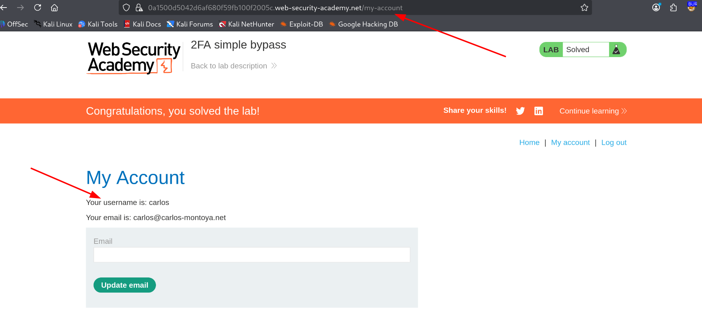

# 2FA Simple Bypass

**Lab:** [PortSwigger  2FA Simple Bypass](https://portswigger.net/web-security/authentication/multi-factor/lab-2fa-simple-bypass)  
**Category:** Authentication  
**Difficulty:** Apprentice

---

## Objective

Bypass the 2FA mechanism enabled on the victim's account.

---

## Given Credentials

```
wiener:peter    --> our credentials
carlos:montoya  --> victim's credentials
```

---

## Walkthrough

### Step 1 - Understanding the 2FA flow

First, log in as `wiener:peter` to observe how the 2FA process works.

After submitting credentials, the application prompts for a 2FA code:



There's also an email client available  the 2FA code gets delivered there:



After entering the correct code, we're successfully logged in as `wiener`.

---

### Step 2 - Analyzing the flow in Burp Suite

Opening Burp's HTTP History, the authentication flow looks like this:

```
POST /login       → credentials accepted, 
GET  /login2      → 2FA input form returned
POST /login2      → code submitted and verified
GET  /my-account?id=wiener  → logged in successfully
```

Two things stood out:

- The 2FA code is only **4 digits**  possible to brute-force if there's no rate limiting.
- After `POST /login`, the server redirects to `/login2`  but what if we **skip `/login2` entirely** and navigate directly to `/my-account?id=carlos`???

---

### Step 3 - Testing the bypass

Log in with the victim's credentials `carlos:montoya`:



With Burp Proxy intercept on, forward the `POST /login` request but **drop the `GET /login2` request** before it loads:



Now navigate directly to `/my-account` in the browser:



We're in no 2FA code entered at all.

---

## Root Cause

The server grants a fully a right after the password check, before 2FA is completed. The `/login2` step is enforced only by a redirect, with no server-side check ensuring 2FA was actually verified before granting access to protected pages.

---

## Remediation

- All protected endpoints should verify server-side that 2FA is complete before serving content.
- Navigating directly to `/my-account` without completing 2FA should redirect back to `/login2` or invalidate the session.
