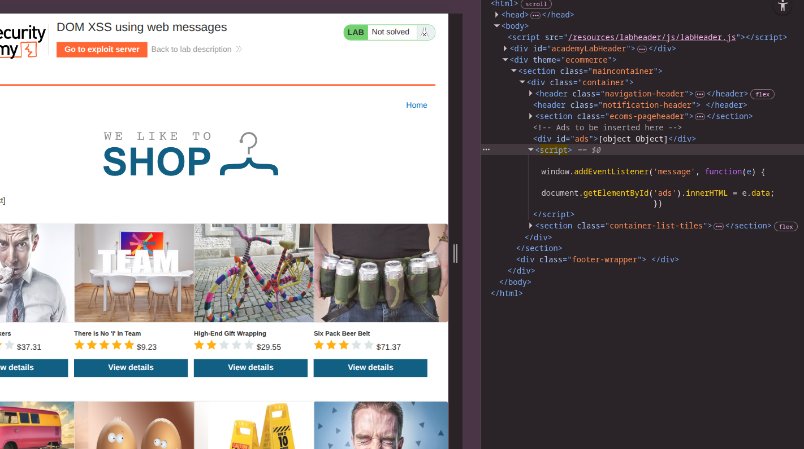
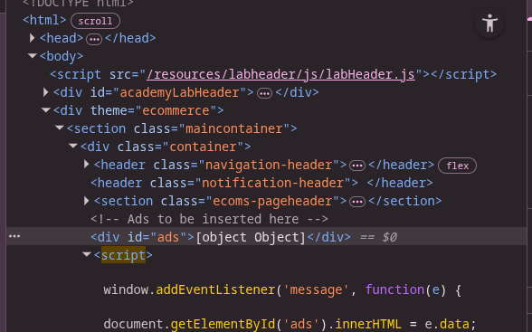
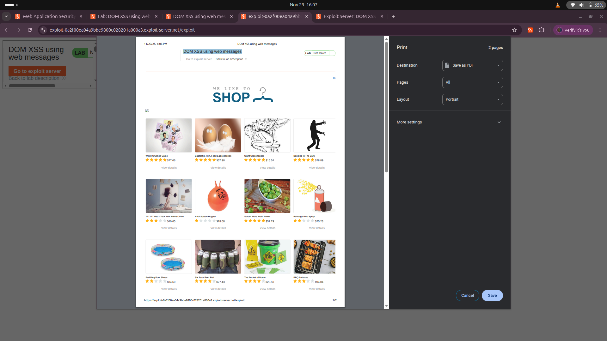
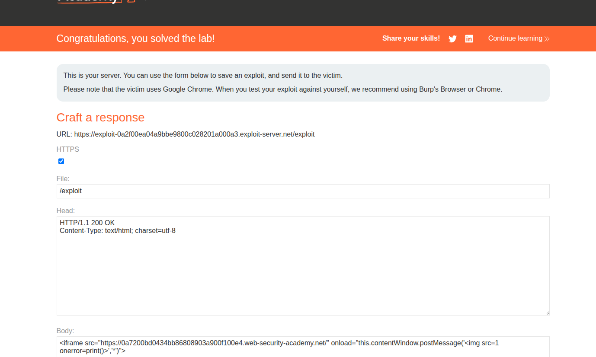

# Lab: DOM XSS using Web Messages


## Objective
This lab demonstrates a simple web message vulnerability. To solve this lab, use the exploit server to post a message to the target site that causes the `print()` function to be called.

---

## Analysis

### Initial Observation
- **Website Appearance:**
  
  - The website includes an exploit server, which can be used to send data to the victim to trigger XSS.

### Inspecting the Code
- **Developer Tools:**
  
  - The JavaScript code responsible for the vulnerability:
    ```javascript
    window.addEventListener('message', function(e) {
        document.getElementById('ads').innerHTML = e.data;
    });
    ```
  - **Explanation:**
    - An `EventListener` listens for messages.
    - The received message (`e.data`) is directly inserted into the `innerHTML` of the element with the ID `ads`.
  

---

## Exploitation

### Using the Exploit Server
To exploit this vulnerability and trigger XSS:

1. **Craft the Payload:**
    ```html
    <iframe src="https://0ad50028030bfb4d8003768b004c002d.web-security-academy.net/" 
            onload="this.contentWindow.postMessage('', '*')">
    </iframe>
    ```
2. **Explanation:**
    - The `iframe` loads the target site.
    - The `postMessage` method sends a malicious payload (``) to the target site.
3. **Result:**
    - The payload triggers the XSS vulnerability, solving the lab.

---

## Some Explain about Payloads: 
- **postMessage(message, targetOrigin) — 2 cheeze leta hai**
1) **message → kya bhejna hai**
 *Yaha:*
 ```bash
 ''
```
- **Ye tumhara payload hai jo iframe ke andar page ko bheja ja raha hai.**

2) **targetOrigin → kahan bhejna hai**
*Yaha:*
```bash
'*'

```
**Matlab kisi bhi origin pe bhejo, koi fark nahi padta.**

## LAB SOLVED: 
- **And often visiting the /exploit url we can see that the print() fuction is being called:**


- **And now deliver exploit to victim and then the lab has been solved**


## Conclusion
By leveraging the `postMessage` method and the insecure handling of `innerHTML`, we successfully exploited the DOM XSS vulnerability. This highlights the importance of validating and sanitizing user inputs in web applications.


<iframe src="https://0a7200bd0434bb86808903a900f100e4.web-security-academy.net/" onload="this.contentWindow.postMessage('','*')">