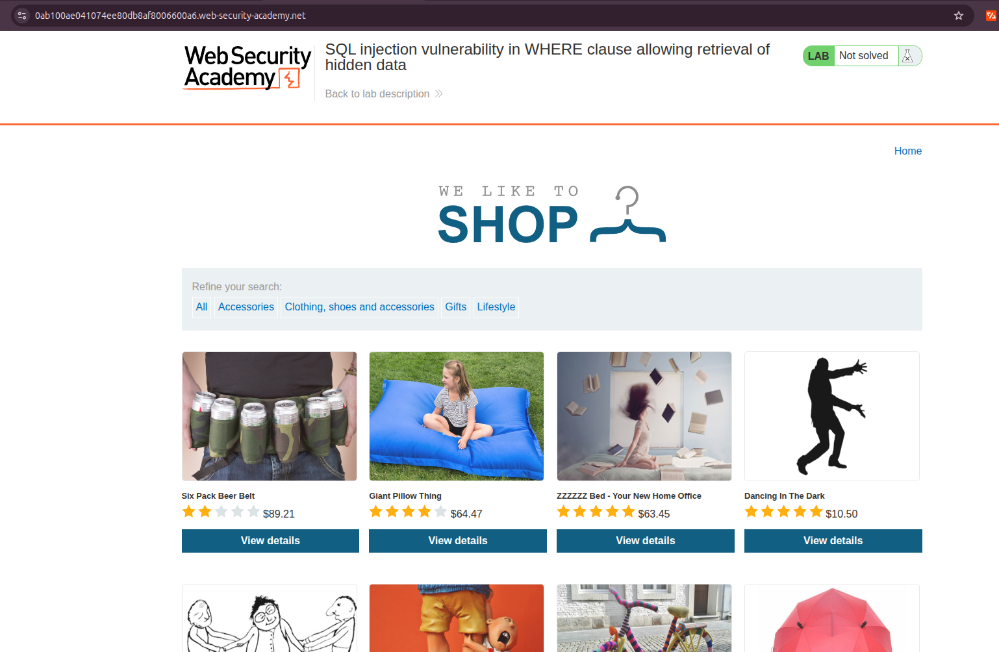
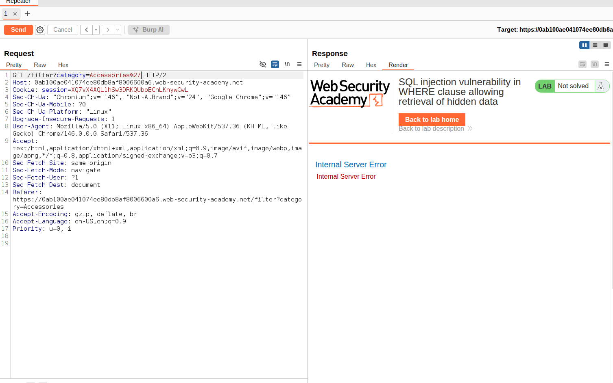
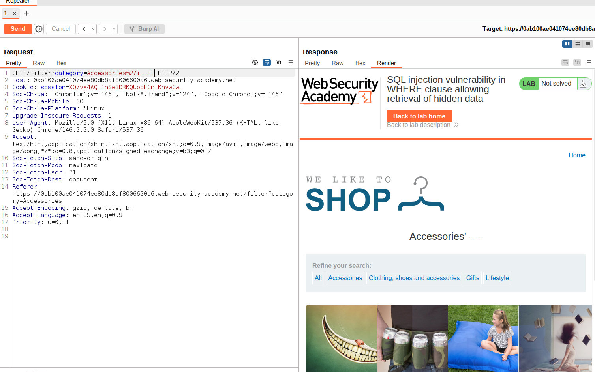
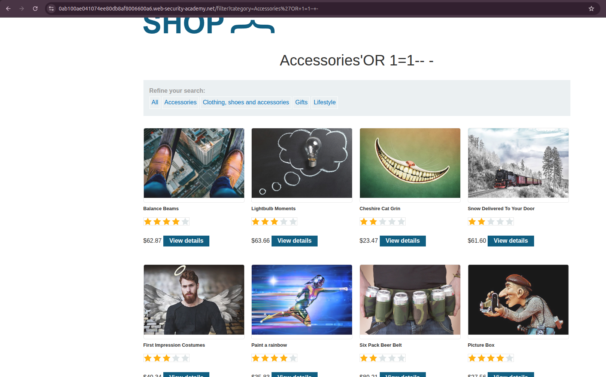

# SQL Injection  WHERE Clause Filter Bypass (Hidden Data Retrieval)

**Lab:** [PortSwigger Web Security Academy  SQL injection vulnerability in WHERE clause allowing retrieval of hidden data](https://portswigger.net/web-security/sql-injection/lab-retrieve-hidden-data)  
**Difficulty:** Apprentice  
**Category:** SQL Injection  
**Author:** Rabin Gaire(rakshak07) 

---

> 🔬 **Want to try this yourself?**  
> This writeup is based on a free, hands-on lab from PortSwigger Web Security Academy.  
> **[→ Access the lab here](https://portswigger.net/web-security/sql-injection/lab-retrieve-hidden-data)**  
> No installation required  runs entirely in your browser.

---

## Overview

This writeup documents the identification and exploitation of a SQL injection vulnerability present in a product category filter. The objective was to retrieve unreleased/hidden products by manipulating the SQL query executed server-side.

---

## Reconnaissance

### Application Behavior

Upon loading the lab homepage, the application presents a product catalog with category-based filtering options:

- All
- Accessories
- Clothing, Shoes & Accessories
- Gifts
- Lifestyle

**Figure 1  Lab Homepage**



Observing the URL structure when a filter is applied reveals a clear and predictable pattern:

```
https://<lab-id>.web-security-academy.net/filter?category=Accessories
```

**Pattern:** `/filter?category=<filter_value>`

The `category` parameter is directly reflected in the request and is a logical candidate for SQL injection testing, as it is likely used to construct a backend database query that filters products by category.

---

## Vulnerability Identification

### Step 1  Single Quote Injection

The first probe is the classic single-quote `'` character appended to the parameter value, designed to break out of the SQL string context:

```
/filter?category=Accessories'
```

**Figure 2  Internal Server Error**



> **Note:** A 500 Internal Server Error alone does not confirm SQL injection. It indicates the input is being processed by the backend in an unexpected way, warranting further investigation. It could be a generic error handler. We continue.

---

### Step 2  Comment-Based Confirmation

To determine if the error is caused by SQL syntax disruption rather than generic input validation, a SQL comment sequence is appended:

```
/filter?category=Accessories'--+-
```

**Payload breakdown:**

| Component | Purpose |
|-----------|---------|
| `'` | Closes the open string literal in the SQL query |
| `--` | SQL inline comment  instructs the parser to ignore everything that follows |
| `-` | Padding character (no technical significance; `-- ` with a trailing space is the minimum required) |

**Figure 3  SQL Injection Confirmed**



The page returns a valid response with results  the SQL syntax is intact and the comment sequence successfully neutralised any trailing query clauses (such as `AND released = 1`). **SQL injection is confirmed.**

---

## Exploitation

### Retrieving Hidden/Unreleased Products

With injection confirmed, the next step is to craft a payload that bypasses the `released` condition assumed to be filtering out hidden products. The following payload uses a tautology  a condition that is always true  to return all rows regardless of their release status:

```sql
' OR 1=1-- -
```

**Full URL (URL-encoded):**

```
https://<lab-id>.web-security-academy.net/filter?category=Accessories%27+OR+1%3D1--+-
```

**Figure 4  Hidden Products Revealed**



The response now includes **all products across all categories**, including those not yet released. The injected `OR 1=1` condition evaluates to true for every row, effectively removing the category and release status filters entirely.

---

## Root Cause Analysis

The backend SQL query likely takes the following form:

```sql
SELECT * FROM products WHERE category = 'Accessories' AND released = 1
```

After injection, the query becomes:

```sql
SELECT * FROM products WHERE category = 'Accessories' OR 1=1-- - AND released = 1
```

Because `OR 1=1` short-circuits the `WHERE` clause evaluation, every row in the `products` table is returned, including unreleased items.

---

## Impact

| Risk Factor | Assessment |
|-------------|------------|
| **Confidentiality** | Unreleased product data exposed to unauthenticated users |
| **Integrity** | Not directly affected by this payload, but further exploitation is possible |
| **Availability** | Heavy `OR 1=1` queries can cause performance degradation at scale |
| **Escalation Potential** | High  same injection point could be leveraged for UNION-based data extraction, blind SQLi enumeration, or out-of-band exfiltration |

---

## Key Takeaways

1. **User-supplied input in SQL queries without parameterisation is always dangerous**, even when the input appears cosmetic (like a category name).
2. **A 500 error is a signal, not a conclusion.** Systematic follow-up testing is required to confirm the root cause.
3. **SQL comment sequences (`--`, `#`, `/*`)** are a reliable mechanism to neutralise trailing query logic when injecting into string contexts.
4. **Tautologies (`OR 1=1`)** are a foundational exploitation primitive  simple, effective, and immediately revealing in non-blind scenarios.

---

## Defensive Recommendations

### 1. Parameterised Queries (Prepared Statements)  Primary Fix

This is the only reliable mitigation. User input must never be concatenated directly into SQL strings.

**Vulnerable code (conceptual):**
```python
query = "SELECT * FROM products WHERE category = '" + category + "' AND released = 1"
```

**Secure code:**
```python
query = "SELECT * FROM products WHERE category = ? AND released = 1"
cursor.execute(query, (category,))
```

The database driver treats the parameter as data, not executable SQL  injection is structurally impossible.

---

### 2. Input Validation and Allowlisting

For fields with a known set of valid values (e.g., product categories), validate input against an explicit allowlist server-side:

```python
VALID_CATEGORIES = {"Accessories", "Clothing", "Gifts", "Lifestyle"}

if category not in VALID_CATEGORIES:
    return 400  # Reject unknown values
```

> **Important:** Allowlisting is a defence-in-depth measure, **not a substitute** for parameterised queries.

---

### 3. Least Privilege Database Accounts

The application database user should only have the permissions it genuinely needs:

- `SELECT` on product tables  yes
- `DROP`, `INSERT`, `UPDATE` on sensitive tables  no
- Access to other databases or system tables  no

This limits the blast radius if an injection vulnerability is exploited.

---

### 4. Web Application Firewall (WAF)

A WAF can detect and block common SQL injection patterns at the perimeter. While not a root-cause fix and bypassable by a skilled attacker, it adds a meaningful detection and blocking layer as part of a layered security architecture.

---

### 5. Error Handling

Never expose raw database error messages to end users. Generic error pages prevent attackers from gleaning schema information from error output.

```
# Bad: "You have an error in your SQL syntax near 'Accessories'' at line 1"
# Good: "Something went wrong. Please try again."
```

---

## Summary

| Item | Detail |
|------|--------|
| **Vulnerability** | SQL Injection  Unsanitised `category` parameter |
| **Attack Vector** | URL query string (`/filter?category=`) |
| **Payload Used** | `' OR 1=1-- -` |
| **Impact** | Full bypass of product release filter; disclosure of hidden data |
| **Fix** | Parameterised queries; input allowlisting |
| **OWASP Classification** | [A03:2021  Injection](https://owasp.org/Top10/A03_2021-Injection/) |

---

*Writeup produced in a controlled lab environment. All testing was performed against systems explicitly authorised for security research.*

---

**Practice this vulnerability yourself:**  
[PortSwigger Web Security Academy  SQL Injection: Retrieving Hidden Data](https://portswigger.net/web-security/sql-injection/lab-retrieve-hidden-data)