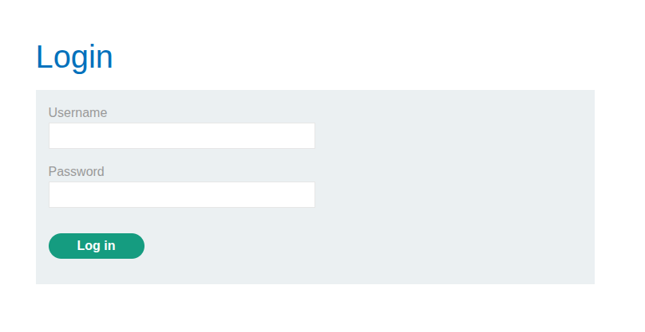
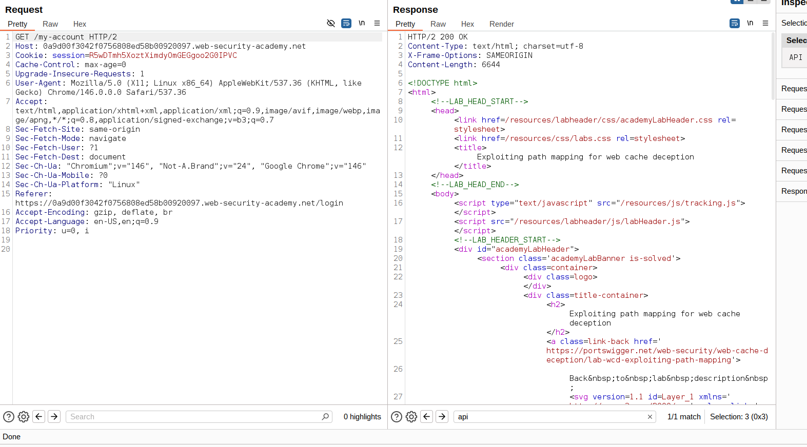
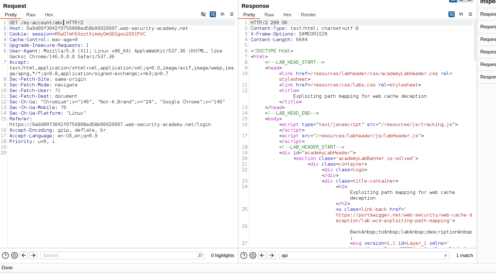
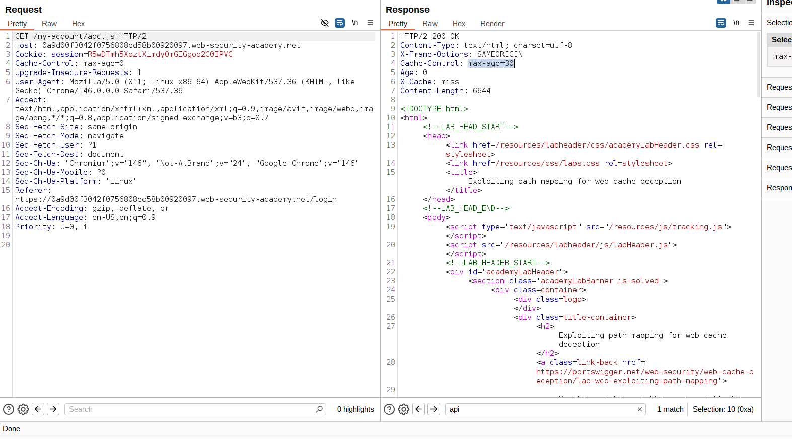
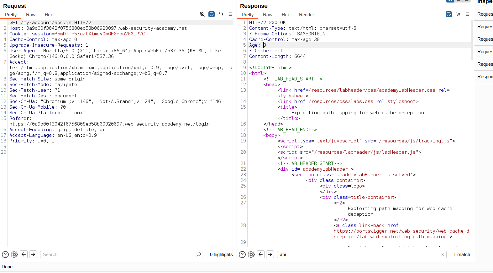
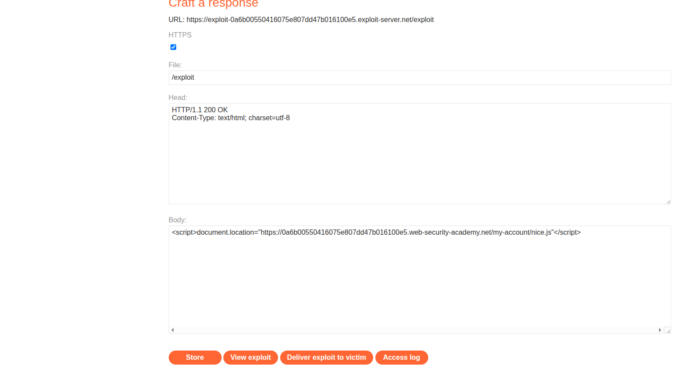

## Exploiting path mapping for web cache deception 


## PRE-REQUISTICE THINGS TO KNOW BEFORE SOLVING THIS LAB:: 
Exploiting path mapping discrepancies
To test how the origin server maps the URL path to resources, add an arbitrary path segment to the URL of your target endpoint. If the response still contains the same sensitive data as the base response, it indicates that the origin server abstracts the URL path and ignores the added segment. For example, this is the case if modifying /api/orders/123 to /api/orders/123/foo still returns order information.

To test how the cache maps the URL path to resources, you'll need to modify the path to attempt to match a cache rule by adding a static extension. For example, update /api/orders/123/foo to /api/orders/123/foo.js. If the response is cached, this indicates:

That the cache interprets the full URL path with the static extension.
That there is a cache rule to store responses for requests ending in .js.
Caches may have rules based on specific static extensions. Try a range of extensions, including .css, .ico, and .exe.

You can then craft a URL that returns a dynamic response that is stored in the cache. Note that this attack is limited to the specific endpoint that you tested, as the origin server often has different abstraction rules for different endpoints.

Note
Burp Scanner automatically detects web cache deception vulnerabilities that are caused by path mapping discrepancies during audits. You can also use the Web Cache Deception Scanner BApp to detect misconfigured web caches.


### To solve the lab, find the API key for the user carlos. You can log in to your own account using the following credentials: wiener:peter.

Required knowledge
To solve this lab, you'll need to know:

How regex endpoints map URL paths to resources.
How to detect and exploit discrepancies in the way the cache and origin server map URL paths.

## Opening a lab there was a login portal: 
- As we have: **username**:**wiener** , **password**:**peter** let's login with this credentials and intercept the burp


- Now after login there was a / my-account endpoint which contains a sensitive info such as email and api key besides of that api-key seems to be more sensitive


- Let's look it in the burp 


- as shown in the figure this doesnot properly contains any X-CACHE type header but it does contains sensitive info in resopse
- so now let's add new path: /abc after /myaccount it looks like: /myaccount/abc


- ok giving path abc also not having any cache related items

- let's try it with /abc.js --> sometimes it would be stored in cache as extension

- and yes it's being cached --> 
 - Cache-Control: max-age=30 --> after 30 sec it will stored in cache 
 - X-Cache: miss --> this isn't cached yet I need to send this request again after 30 sec to cache 
 

 ## NOW WE GOT THE CACHE HIT WHAT TO DO?? 
 - Send the cache responese to the victim and extract their api key 
 - now we will be go to the exploit server and send this payload to victim: 
 ```
 <script document.location="https://LABURL/something.js"></script> --> cached it and see the response
 ```

- now we send this now when victim sees this that will be cached and their api key will be shown in response when we go throguh that url.
